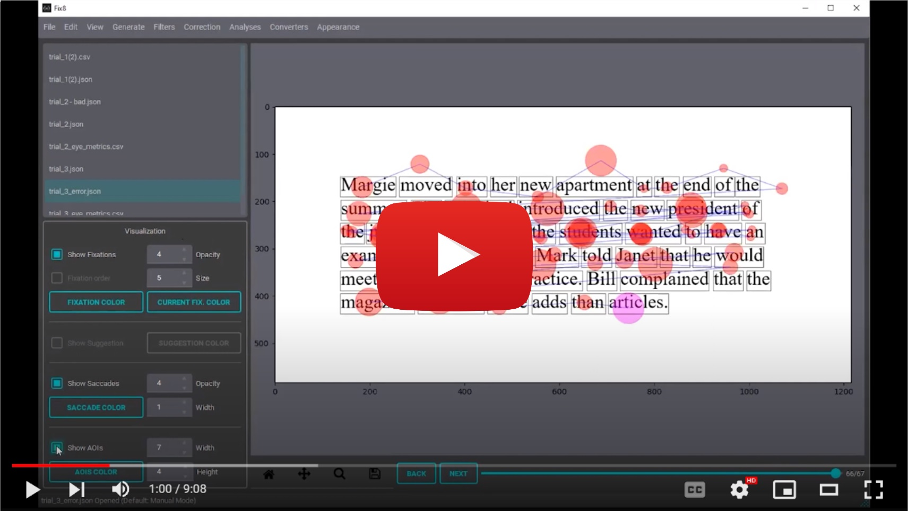

# Fix8 Overview

Fix8 (Fixate) is an Open-Source GUI Tool for Working with Eye Tracking Data in Reading Tasks. FIx8 includes a novel semi-automated correction approach for eye tracking data in reading tasks.  The proposed approach allows the user to collaborate with an algorithm to produce accurate corrections in less time without sacrificing accuracy.


[](https://youtu.be/Zw2uO3IE2vI?si=h1yYnNQag-0Q7lVe)


# Main Features ⭐

- Drift correction including manual, assisted (semi-automated), and automated correction.
- Fully customizable and interactive visualization.
- Synthetic data and distortion generation including full control of word skipping, within-line and between-line regressions.
- Filters: high-pass, low-pass, outlier, merge, and outside screen filters.
- Analyses including hit-test and eye movement metrics like First-Fixation Duration, Single-Fixation Duration, and Total Time.
- Data Converters: EyeLink data, ASCII, CSV, and JSON are supported.
- Request a feature by making an issue on this page!

# Executables  💻

- Windows: 

    Compressed executable (slow to load, single file): <a id="raw-url" href="https://github.com/nalmadi/fix8/tree/main/executables/Fix8_v1.1_onefile.zip">[Download]</a> 

    UNcompressed executable (faster load, many files): <a id="raw-url" href="https://github.com/nalmadi/fix8/tree/main/executables/Fix8_v1.1.zip">[Download]</a> 

    > to download and run Fix8 do the following:
    >- Click on one of the download link above.
    >- In the top right, right-click the **Raw** button.
    >- Click on "Save as..."
    >- Unzip the file.
    >- Locate Fix8.exe and run it, first run might take a minute.
    >- Enjoy!


- Mac/Linux: coming soon!

# Run Fix8 from code 🚀
To run Fix8 from the Python code, follow these steps:

1. **Clone the Repository:**
    ```bash
    git clone https://github.com/nalmadi/fix8.git
    cd fix8
    ```

2. **Create a Virtual Environment:**

    It's recommended to use a virtual environment to manage dependencies and isolate your project's environment:

    ```bash
    python -m venv myvenv
    ```

    Activate the virtual environment:
    
    **On Windows:**
    
    ```bash
    myvenv\Scripts\activate
    ```

    **On macOS and Linux:**
    
    ```bash
    source myvenv/bin/activate
    ```

3. **Install Requirements:**

    Once the virtual environment is activated, install the package via pip:

    ```bash
    pip install .
    ```

4. **Run the Tool:**

    Once done, run the tool simply by entering the command "fix8" in the terminal:

    ```bash
    fix8
    ```


5. **Deactivate the Virtual Environment:**

    When you're done using the tool, deactivate the virtual environment:

    ```bash
    deactivate
    ```


# Keyboard Shortcuts ⌨️​
a: 		next fixation

z: 		previous fixation

space: 		accept suggestion

backspace: 	delete fixation (click on fixation to select)

j:      move the selected fixation to the left

l:      move the selected fixation to the right

i:      move the selected fixation upward

k:      move the selected fixation downward


* * *


# Citation 📝

Please cite our paper if you user this tool:

TBD

          
