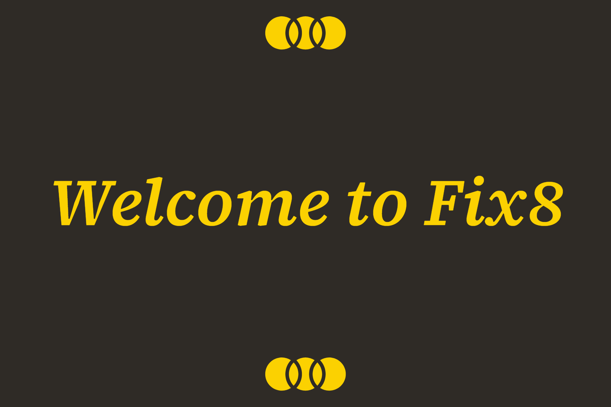

# Fix8

> **Software Name**: Fix8  
> **Version**: 0.01
> **Date**: 2022-12-06

# Software Summary 💻

Fix8 is a tool that provides manual, automated, and semi-automated correction methods for eye tracking data in reading tasks with a graphical user interface.

Currently, Fix8 is in Pre-Alpha testing, so please give it try and give us feedback!

# Requirements ⚙️

-   PyQT5
-   Matplotlib
-   Numpy

Also see requirments.txt in .src folder

# How to Use 👇

### 1. Open Stimulus

The first thing you are going to want to do is open your image which contains the text that was read. This is the 'stimulus.' The stimulus file is independent of any data, so you can open a different stimulus at any time and all fixation data will be retained.** Make sure that your stimulus is a PNG file in order for it to be displayed.**

### 2. Open Folder

After you've opened your stimulus, you will then get access to the open folder button. The folder you open should contain the trial data you want to analyze. It will then be displayed in a file tree in the file window to the left of the tool.

**Important**: If you reopen a folder, all trial data from a current trial gets wiped, as opening a folder gets new trials. **Make sure to save your work before you open a new folder if you need to.**

* * *

### 3. Access the Trials

Once you have a display of different trials to choose from in your file window, double click one, and that will be the current data you are analyzing. Double click again, and it overrides all fixation data to that trial. **Once again, make sure you save anything if necessary before clicking another trial, as it overrides. **Double clicking a trial is independent of any filters.

!! Now that you have access to a trial's data, play around with the different filters!

### 4. Select a Correction Algorithm

Once a trial is picked, you can now correct the trial. Selecting a correction algorithm tells the program to use that algorithm when doing manual, semi-automated, or fully automated correction. Also, when you select an algorithm, you can view the suggested correction for each fixation one by one. (Soon, you will be able to view multiple.) De-selecting the algorithm disables any correction features.

### 5. Semi-Automated Correction

If you look at the Semi-Automation section of tools, you can see buttons such as 'next fixation', 'previous fixation', and 'confirm suggestion.' When viewing a suggested correction, you can traverse through the fixations and look at any of the suggestions. If you like one of these suggestions, you can click 'confirm suggestion' and it will overwrite the original fixation with the corrected one and move on to the next fixation.

### 6. Fully Automated Correction

This section of tools is straight forward. Just click the 'Correct All Fixations' button, and the tool will overwrite all the fixations to the corrected ones.

### 7. Manual Correction

In order to do manual correction, all you need to do is select a fixation with your mouse and drag it to where you wish for it to be. Once you do this, the suggested correction for that fixation, along with the saccade, will update based on the new position of the manual correction. Drag and drop animation is very laggy in the current version, so animation is disabled.

* * *

# Currently in Development + Bugs

-   Improve performance of drag and drop; it is quite laggy at the moment, needs to be smooth.
-   There is a very rare bug which occurs when switching stimuli, and the fixation filters do not work/do not show fixations. It is indentified where the bug occurs, so there is a fix, but not a necessary one. Currently working on a good approach to resolve this minor issue.
-   Progress bar under development.
-   Undo and redo buttons under development.

# Give us Feedback ✍️

Send us feedback so we can make the essential improvements for full release!

[nalmadi@colby.edu](mailto:nalmadi@colby.edu)

[bmtorr24@colby.edu](mailto:bmtorr24@colby.edu)

          
