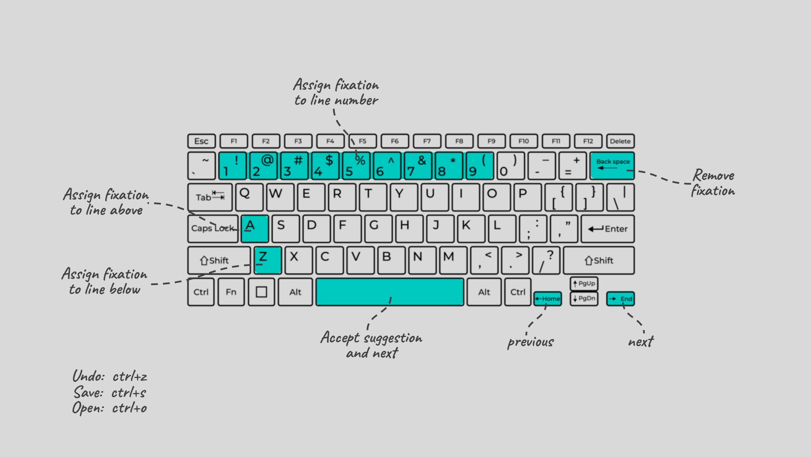

# Fix8 Overview

Fix8 (Fixate) is an open-source GUI Tool for working with eye tracking data in reading tasks. FIx8 includes a novel semi-automated correction approach for eye tracking data in reading tasks. The proposed approach allows the user to collaborate with an algorithm to produce accurate corrections in less time without sacrificing accuracy.


[](https://youtu.be/Zw2uO3IE2vI?si=h1yYnNQag-0Q7lVe)


# Main Features ⭐

- Drift correction including manual, assisted (semi-automated), and automated correction.
- Fully customizable and interactive visualization.
- Synthetic data and distortion generation including full control of word skipping, within-line and between-line regressions.
- Filters: high-pass, low-pass, outlier, merge, and outside screen filters.
- Analyses and reports including hit-test and eye movement metrics like Fixation count, First-Fixation Duration, Single-Fixation Duration, and Total Time.
- Data Converters: EyeLink data, ASCII, CSV, and JSON are supported.
- Request a feature by making an issue in this repository!


# Manual 📖
A comprehensive manual of Fix8 GUI and every feature can be found here: [Fix8_Manual_v1.2](https://docs.google.com/document/d/14g-kQfCTfn-jabcN50_mCkjD39DFVtT_sLlosPTREzQ/edit?usp=sharing)


# Executables 💻

- Windows: 

    <!-- Compressed executable (single file): <a id="raw-url" href="https://github.com/nalmadi/fix8/tree/main/executables/Fix8_v1.1_onefile.zip">[Download]</a>  -->

    Download Windows executable here: <a id="raw-url" href="https://github.com/nalmadi/fix8/releases/download/v1.3/fix8_v1.3_Windows.zip">[Windows]</a>

    >- Unzip the downloaded file.
    >- Locate Fix8.exe and run it, first run might take a couple of minutes.
    >- Enjoy!

- Mac:

    Download Mac app here: <a id="raw-url" href="https://github.com/nalmadi/fix8/releases/download/v1.3/fix8_v1.3_Mac.dmg">[Mac App]</a>
    
    >- Right-click on `fix8` and select `open.`
    >- A message that reads `fix8.app can't be opened because Apple cannot check it for malicious software.` click on 'open' then 'run' to run Fix8.
    --
    In some cases, you might have to do the following to allow the app to run:
        1.Open System Settings.
        2. Click Privacy & Security, scroll down, and click the Open Anyway button to confirm your intent to open or install the app.
        3. When the warning prompt reappears, click 'Open'.
        4. Now, can open Fix8 in the future by double-clicking it.
    --
    >- First run takes a couple of minutes for the files to be scanned, please be patient.  Running the app after that will take less than five seconds.
    >- Enjoy!

- Datasets:

    Download the datasets here: <a id="raw-url" href="https://github.com/nalmadi/fix8/releases/download/v1.3/fix8_v1.3_datasets.zip">[Datasets]</a>

# Python Compatibility 🐍
Fix8 has been thoroughly tested and runs reliably on Python versions 3.9, 3.10, and 3.11. Support for Python 3.12 and 3.13 is in progress, please checkout the  <a id="raw-url" href="https://github.com/nalmadi/fix8/tree/py313-updates">`[py313-updates]`</a> branch of this repository for the latest Python 3.13 compatible version of Fix8.

# Run Fix8 from code 🚀
To run Fix8 from the Python code, follow these steps:

## Option 1: Using Python venv
1. **Clone the Repository:**
    ```bash
    git clone https://github.com/nalmadi/fix8.git
    cd fix8
    ```

2. **Create a Virtual Environment:**

    It's recommended to use a virtual environment to manage dependencies and isolate your project's environment:

    ```bash
    python -m venv myvenv
    ```

    Activate the virtual environment:
    
    **On Windows:**
    
    ```bash
    myvenv\Scripts\activate
    ```

    **On macOS and Linux:**
    
    ```bash
    source myvenv/bin/activate
    ```

3. **Install Requirements:**

    Once the virtual environment is activated, install the package via pip:

    ```bash
    pip install .
    ```

    If you plan to make changes to the code and rerun the package with the new changes, use this command instead:

   ```bash
   pip install -e .
   ```

5. **Run the Tool:**

    Once done, run the tool simply by entering the command "fix8" in the terminal:

    ```bash
    fix8
    ```


6. **Deactivate the Virtual Environment:**

    When you're done using the tool, deactivate the virtual environment:

    ```bash
    deactivate
    ```

## Option 2: Using conda Environment
1. **Clone the Repository:**
    ```bash
    git clone https://github.com/nalmadi/fix8.git
    cd fix8
    ```

2. **Create and Activate conda Environment:**

    It's recommended to use a conda environment to manage dependencies and ensure compatibility:

    ```bash
    conda create -n fix8env python=3.11
    conda activate fix8env
    ```

3. **Install Requirements:**

    Once the conda environment is activated, install the package via pip:

    ```bash
    pip install .
    ```

    If you plan to make changes to the code and rerun the package with the new changes, use this command instead:

    ```bash
    pip install -e .
    ```

4. **Run the Tool:**

    Once done, run the tool simply by entering the command "fix8" in the terminal:

    ```bash
    fix8
    ```

5. **Deactivate the Environment:**

    When you're done using the tool, deactivate the conda environment:

    ```bash
    conda deactivate
    ```


# Keyboard Shortcuts ⌨️​
[](https://youtu.be/Zw2uO3IE2vI?si=h1yYnNQag-0Q7lVe)


| Key         | Functionality                               |
| ----------- | ------------------------------------------- |
| a           | assign current fixation to line above       |
| z           | assign current fixation to line below       |
| space       | accept suggestion                           |
| backspace   | delete fixation (click on fixation to select)|
| right       | next fixation                               |
| left        | previous fixation                           |
| 1-9         | assign fixation to the line number          |


# Datasets 🗂️​
Complete or partial data from the following datasets is included in Fix8:


- **AlMadi2018**: Al Madi, Naser, and Javed Khan. "Constructing semantic networks of comprehension from eye-movement during reading." 2018 IEEE 12th International Conference on Semantic Computing (ICSC). IEEE, 2018.
- **EyeLink_experiment**: Al Madi, Naser, and Javed Khan. "Constructing semantic networks of comprehension from eye-movement during reading." 2018 IEEE 12th International Conference on Semantic Computing (ICSC). IEEE, 2018.
- **EMIP2021**: Bednarik, Roman, et al. "EMIP: The eye movements in programming dataset." Science of Computer Programming 198 (2020): 102520.
- **EMIP2021_90**: Al Madi, Naser, et al. "EMIP Toolkit: A Python Library for Customized Post-processing of the Eye Movements in Programming Dataset." ACM Symposium on Eye Tracking Research and Applications. 2021.
- **Carr2022**: Carr, J. W., Pescuma, V. N., Furlan, M., Ktori, M., & Crepaldi, D. (2022). Algorithms for the automated correction of vertical drift in eye-tracking data. Behavior Research Methods, 54(1), 287-310.
- **GazeBase**: Griffith, H., Lohr, D., Abdulin, E., & Komogortsev, O. (2021). GazeBase, a large-scale, multi-stimulus, longitudinal eye movement dataset. Scientific Data, 8(1), 184.
- **MET_Dataset**: Raymond, O., Moldagali, Y., & Al Madi, N. (2023, May). A dataset of underrepresented languages in eye tracking research. In Proceedings of the 2023 Symposium on Eye Tracking Research and Applications (pp. 1-2).


# API and Documentation for Developers ⚙️
Developers can find the Fix8 Core API documentation [HERE](https://fix8-eye-tracking.github.io/)


# Citation 📝

Naser Al Madi, Brett Torra, Yixin Li, Najam Tariq. (2024). Combining Automation and Expertise: A Semi-automated Approach to Correcting Eye Tracking Data in Reading Tasks.
```bash
@article{Al2024combining,
author = {Naser Al Madi, Brett Torra, Yixin Li, Najam Tariq},
title = {Combining Automation and Expertise: A Semi-automated Approach to Correcting Eye Tracking Data in Reading Tasks},
journal = {Behavior Research Methods},
year = {2025},
volume = {},
pages = {},
doi = {}
}
```
          
